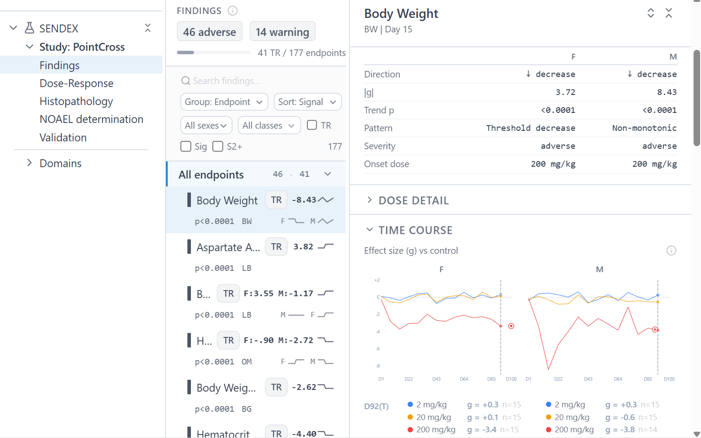

# SENDEX — SEND Explorer

Analytical browser, and a decision support framework for preclinical toxicology studies in [CDISC SEND](https://www.cdisc.org/standards/foundational/send) (.xpt) format. Reads study folders, runs a statistical and classification pipeline, and surfaces findings through question-driven analysis views.

**Your feedback is important** — We are soliciting feedback and contributions from the preclinical toxicology community. 
- Try the [hosted demo](https://send-data-browser.onrender.com) (first load may take ~1 minute)
- or [open an issue](https://github.com/lbankurova/send-data-browser/issues) on GitHub.

> The production version will also be integrated into [Datagrok](https://datagrok.ai) as a plugin to enable richer "free-world" exploration,
> and enterprise features like connecting to proprietary databases, access control, etc.

## What it does

SENDEX structures the analytical workflow around the common tasks: detect
treatment-related effects → characterize dose-response → assess causality →
evaluate reversibility → determine NOAEL. At each step SENDEX pre-computes
statistics (Dunnett's, Williams', Fisher's exact, ANCOVA, trend tests), flags
cross-domain syndromes (33 rules), scores signals against ECETOC assessment
tiers, and then puts the evidence in front of the reviewer to interpret.

Dual-engine validation runs 400+ CDISC CORE conformance rules alongside 14
custom study design and FDA data quality checks, with per-record evidence and a
triage UI.



## Analysis views

| View | Question it answers |
|---|---|
| Study details | What happened? Metadata, design, timeline, analysis settings |
| Findings | What's affected? Cross-domain adverse effects, syndrome detection, organ drill-down |
| Dose-response | Is it treatment-related? Endpoint characterization, statistical method switching, Bradford Hill causality |
| Histopathology | Are the lesions real? Severity matrices, trends, recovery classification, peer review |
| NOAEL determination | What's the NOAEL? Signal analysis, adversity assessment, protective factors, narrative generation |
| Validation | Is the data clean? CDISC CORE + custom rules, unified triage UI |

Plus a raw domain browser and HTML report generator.

## SEND standard support

SENDEX targets **SENDIG v3.1** (Standard for Exchange of Nonclinical Data
Implementation Guide). Input data is read from SAS XPT transport files
conforming to SEND 3.0 or 3.1 datasets. The SENDIG version and controlled
terminology version are extracted per-study from TS parameters (`SNDIGVER`,
`SNDCTVER`) when available.

Non-conforming datasets are not rejected — the validation engine flags missing
required domains, variables, and controlled terminology violations as findings
with severity tiers, so partial or legacy datasets can still be explored.

### Supported domains

| Category | Domains |
|----------|---------|
| Special Purpose | DM, DS, TS, TA, TE, TX, SE |
| Interventions | EX |
| Findings | BG, BW, CL, CO, DD, EG, FW, LB, MA, MI, OM, PC, PP, SC, VS |
| Supplemental | SUPPMA, SUPPMI |
| Relationships | RELREC |

### Species coverage

| Species | Concordance | ECG | Preferred Biomarkers | HCD | PK Scaling |
|---------|:-----------:|:---:|:--------------------:|:---:|:----------:|
| Rat | Full | Yes | SDH, GLDH, KIM-1, Clusterin, Troponins | SD, Wistar Han, F344 | Yes |
| Dog | Full | Yes (gold-standard QTc) | -- | -- | Yes |
| Monkey | Full | Yes (Fridericia QTc) | -- | -- | Yes |
| Mouse | Full | Yes | -- | CD-1, C57BL/6 | Yes |
| Rabbit | Partial | -- | -- | -- | Yes |
| Minipig | -- | -- | -- | -- | Yes |
| Hamster | -- | -- | -- | -- | Yes |
| Guinea Pig | -- | -- | -- | -- | Yes |

Rat has the deepest support: strain-specific historical control data,
FDA-qualified biomarker panels (REM-11), and human non-relevance mechanism
detection (PPARa agonism, alpha-2u-globulin nephropathy, TSH-mediated thyroid
tumors).

## Quick start

```bash
# Backend
cd backend
pip install -r requirements.txt
python -m generator.generate PointCross   # pre-generate analysis data
uvicorn main:app --reload --port 8000

# Frontend
cd frontend
npm install
npm run dev                               # http://localhost:5173
```

## Stack

| Layer | Tech |
|---|---|
| Frontend | React 19, TypeScript 5.9, TailwindCSS 4, TanStack Query + Table, Radix UI, ECharts, Vite |
| Backend | FastAPI, Python, pandas, scipy, pyreadstat, orjson |
| Data | SEND .xpt files, pre-generated analysis JSON, SQLite (historical control database) |

See [ARCHITECTURE.md](ARCHITECTURE.md) for pipeline details, module map, and engine inventory.

## License

[MIT](LICENSE)
