# Classification Algorithm Flowcharts

Every classification decision the SENDEX analysis engine produces, as flowcharts.

**Source files:** `backend/services/analysis/classification.py`, `backend/generator/view_dataframes.py`, `backend/services/analysis/corroboration.py`, `backend/services/analysis/adversity_dictionary.py`, `backend/services/analysis/adaptive_trees.py`, `backend/services/analysis/progression_chains.py`

---

## Table of Contents

1. [Master Dispatch (assess_finding_with_context)](#1-master-dispatch)
2. [Severity Classification (classify_severity)](#2-severity-classification)
3. [ECETOC Adversity Assessment (assess_finding)](#3-ecetoc-adversity-assessment)
4. [OM Two-Gate Classification (_assess_om_two_gate)](#4-om-two-gate-classification)
5. [Histopath Classification (_classify_histopath)](#5-histopath-classification)
6. [Dose-Response Pattern (classify_dose_response)](#6-dose-response-pattern-classification)
7. [Treatment-Related Determination (determine_treatment_related)](#7-treatment-related-determination)
8. [NOAEL Derivation (build_noael_summary)](#8-noael-derivation)
9. [Signal Score Computation (_compute_signal_score)](#9-signal-score-computation)
10. [Target Organ Determination (build_target_organ_summary)](#10-target-organ-determination)
11. [Intrinsic Adversity Lookup](#11-intrinsic-adversity-lookup)
12. [Corroboration Status](#12-corroboration-status)
13. [NOAEL Confidence Score](#13-noael-confidence-score)
14. [A-Factor Scoring (Treatment-Relatedness)](#14-a-factor-scoring)
15. [B-6 Progression Chain Evaluation](#15-b-6-progression-chain-evaluation)

---

## 1. Master Dispatch

Top-level router: `assess_finding_with_context()` in `classification.py:795`. Every finding passes through here.

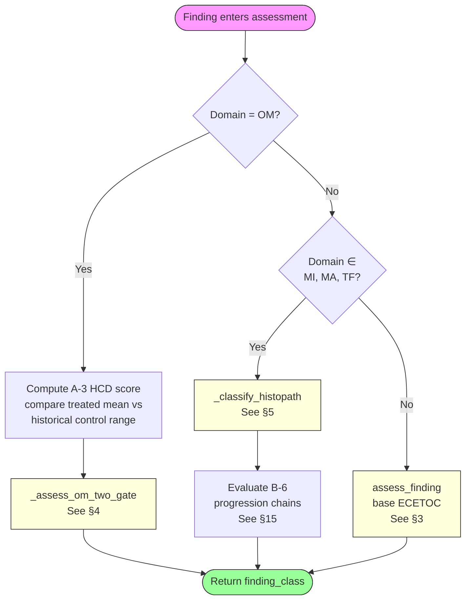

---

## 2. Severity Classification

`classify_severity()` in `classification.py:23`. Three-tier signal classification (adverse/warning/normal). Used for initial signal triage before ECETOC assessment.

### 2a. Continuous Endpoints (default threshold: grade-ge-2-or-dose-dep)

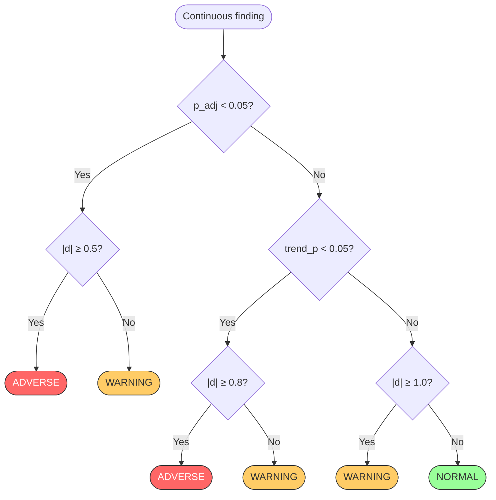

### 2b. Incidence Endpoints (all threshold modes)

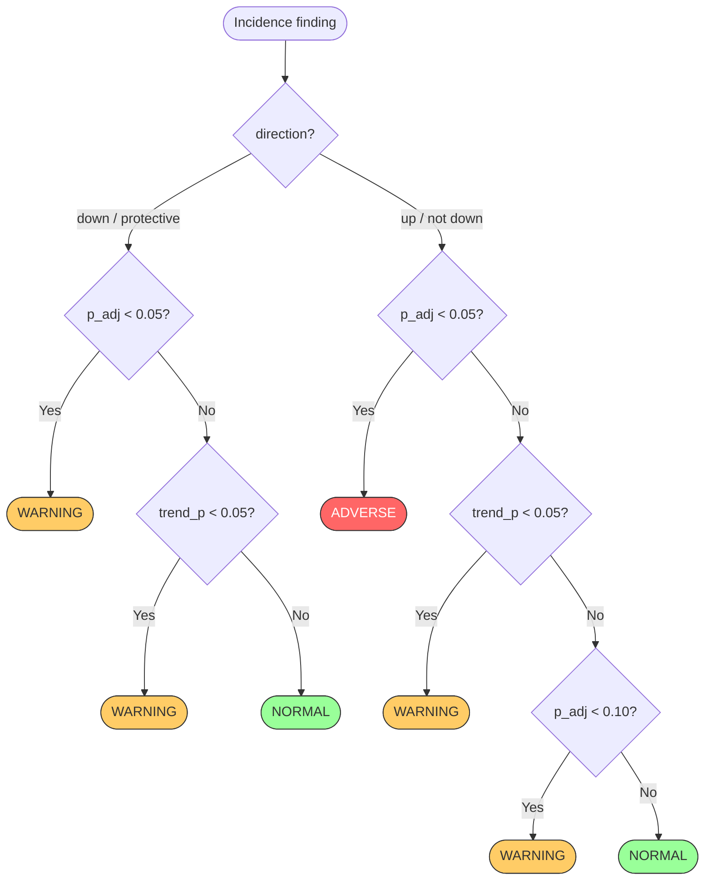

---

## 3. ECETOC Adversity Assessment

`assess_finding()` in `classification.py:487`. Five-class ECETOC-style assessment. This is the base classifier; context-aware wrappers (OM two-gate, histopath trees) override it when applicable.

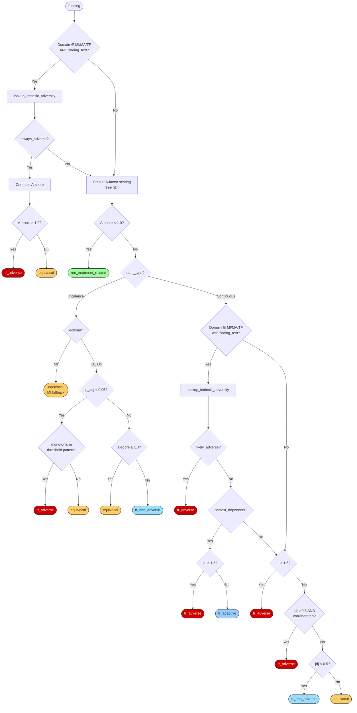

**Legend:** 🔴 tr_adverse | 🟠 equivocal | 🔵 tr_adaptive / tr_non_adverse | 🟢 not_treatment_related

---

## 4. OM Two-Gate Classification

`_assess_om_two_gate()` in `classification.py:609`. Organ weight findings use a two-gate system: statistical significance × magnitude (% change vs organ-specific threshold).

```mermaid
flowchart TD
    START([OM Finding]) --> PCT{pct_change<br/>available?}
    PCT -->|No| FALLBACK[Fall through to<br/>assess_finding §3]

    PCT -->|Yes| BRAIN{floor = 0?<br/>Brain special case}
    BRAIN -->|Yes| BRAIN_STAT{p_adj < 0.05?}
    BRAIN_STAT -->|Yes| TR_ADV_BR([tr_adverse])
    BRAIN_STAT -->|No| BRAIN_TR{trend_p < 0.05?}
    BRAIN_TR -->|Yes| EQ_BR([equivocal])
    BRAIN_TR -->|No| NTR_BR([not_treatment_related])

    BRAIN -->|No| STRONG{"|pct| ≥ strong_adverse<br/>AND p < 0.05?"}
    STRONG -->|Yes| TR_ADV_STR([tr_adverse<br/>HCD cannot override])

    STRONG -->|No| GATES["Evaluate gates:<br/>stat_gate = p < 0.05<br/>mag_floor = |pct| ≥ adverse_floor<br/>mag_ceiling = |pct| ≥ variation_ceiling"]

    GATES --> BOTH{stat AND<br/>mag ≥ floor?}
    BOTH -->|Yes| HCD_DN{within HCD?}
    HCD_DN -->|Yes| EQ_HCD([equivocal<br/>HCD downgrade])
    HCD_DN -->|No| TR_ADV([tr_adverse])

    BOTH -->|No| SC{stat AND<br/>ceiling ≤ |pct| < floor?}
    SC -->|Yes| EQ_MOD([equivocal<br/>moderate magnitude])

    SC -->|No| SMALL{stat AND<br/>|pct| < ceiling?}
    SMALL -->|Yes| VSMALL{p < 0.001 AND<br/>|pct| > ceiling/2?}
    VSMALL -->|Yes| EQ_VS([equivocal])
    VSMALL -->|No| HCD_UP{outside HCD?}
    HCD_UP -->|Yes| EQ_HCD2([equivocal<br/>HCD upgrade])
    HCD_UP -->|No| TR_NA([tr_non_adverse])

    SMALL -->|No| NOSTAT{NOT stat AND<br/>mag ≥ floor?}
    NOSTAT -->|Yes| EQ_NS([equivocal<br/>+ trend tiebreaker])

    NOSTAT -->|No| MARG{marginal stats AND<br/>mag ≥ floor AND trend?}
    MARG -->|Yes| EQ_MG([equivocal])

    MARG -->|No| NEITHER{NOT stat AND<br/>NOT mag ≥ floor?}
    NEITHER -->|Yes| TR_CEIL{trend AND<br/>mag ≥ ceiling?}
    TR_CEIL -->|Yes| EQ_TC([equivocal])
    TR_CEIL -->|No| NTR([not_treatment_related])

    NEITHER -->|No| NTR2([not_treatment_related])

    style TR_ADV fill:#c00,stroke:#333,color:#fff
    style TR_ADV_BR fill:#c00,stroke:#333,color:#fff
    style TR_ADV_STR fill:#c00,stroke:#333,color:#fff
    style EQ_HCD fill:#fc6,stroke:#333
    style EQ_MOD fill:#fc6,stroke:#333
    style EQ_VS fill:#fc6,stroke:#333
    style EQ_HCD2 fill:#fc6,stroke:#333
    style EQ_NS fill:#fc6,stroke:#333
    style EQ_MG fill:#fc6,stroke:#333
    style EQ_TC fill:#fc6,stroke:#333
    style EQ_BR fill:#fc6,stroke:#333
    style TR_NA fill:#9df,stroke:#333
    style NTR fill:#9f9,stroke:#333
    style NTR2 fill:#9f9,stroke:#333
    style NTR_BR fill:#9f9,stroke:#333
```

### OM Threshold Reference

| Organ | Variation Ceiling | Adverse Floor | Strong Adverse |
|-------|:-:|:-:|:-:|
| Brain | 0% | 0% | 0% |
| Heart | 5% | 10% | 20% |
| Liver | 10% | 15% | 30% |
| Kidney | 8% | 15% | 30% |
| Spleen | 15% | 25% | 50% |
| Thymus | 20% | 30% | 60% |
| Default | 5% | 15% | 30% |

---

## 5. Histopath Classification

`_classify_histopath()` in `classification.py:854`. For MI/MA/TF findings. Routes context-dependent terms through adaptive decision trees.

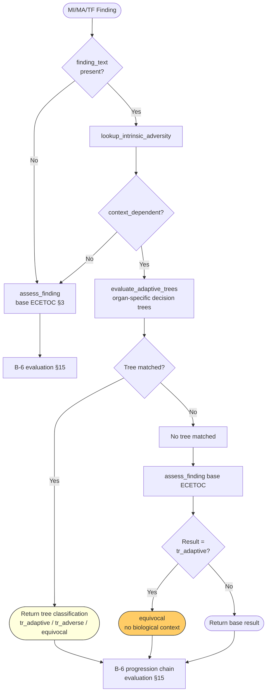

### Adaptive Decision Tree: Liver Example (Hall 2012)

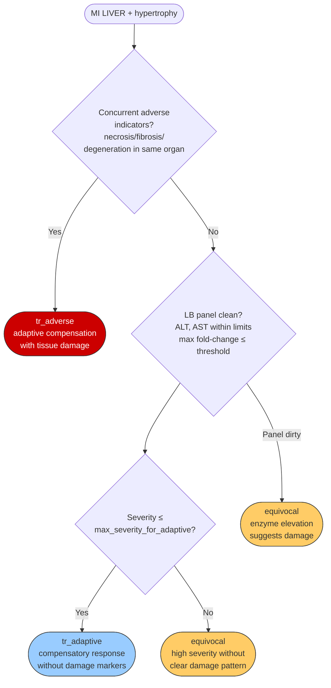

---

## 6. Dose-Response Pattern Classification

`classify_dose_response()` in `classification.py:300`. Determines the shape of the dose-response curve using noise-tolerant equivalence bands.

### 6a. Continuous Data

```mermaid
flowchart TD
    START([Group stats by dose]) --> VALID{≥ 2 groups<br/>with means?}
    VALID -->|No| INSUF([insufficient_data])

    VALID -->|Yes| POOL[Compute pooled SD<br/>RMS of per-group SDs]
    POOL --> TIER[Determine CV% tier<br/>Tier 1: 0.5 SD — BW, RBC, protein<br/>Tier 2: 0.5 SD — liver, kidney, ALT<br/>Tier 3: 0.75 SD — spleen, WBC, TRIG]
    TIER --> BAND[equivalence_band =<br/>tier_fraction × pooled_SD]
    BAND --> STEPS["Build step sequence:<br/>For each consecutive pair:<br/>|diff| ≤ band → 'flat'<br/>diff > 0 → 'up'<br/>diff < 0 → 'down'"]

    STEPS --> CLASSIFY{Non-flat steps?}
    CLASSIFY -->|None| FLAT([flat])
    CLASSIFY -->|All same direction| FLATS{Flats at start?}
    FLATS -->|No| MONO([monotonic_increase<br/>or monotonic_decrease])
    FLATS -->|Yes| THRESH([threshold_increase<br/>or threshold_decrease])
    CLASSIFY -->|Mixed directions| NONMONO([non_monotonic])

    THRESH --> ONSET[onset_dose_level =<br/>first non-flat step]

    MONO --> CONF[Confidence scoring]
    NONMONO --> CONF
    THRESH --> CONF
    FLAT --> CONF

    CONF --> F1{max |d| ≥ 2.0?}
    F1 -->|Yes| S2[score += 2]
    F1 -->|No| F1B{max |d| ≥ 0.8?}
    F1B -->|Yes| S1[score += 1]
    F1B -->|No| S0[score += 0]

    S2 --> F2{Naturally monotonic<br/>without band?}
    S1 --> F2
    S0 --> F2
    F2 -->|Yes| SPLUS[score += 1]
    F2 -->|No| SKEEP[score unchanged]

    SPLUS --> CLVL{score?}
    SKEEP --> CLVL
    CLVL -->|≥ 3| HIGH([HIGH confidence])
    CLVL -->|≥ 1| MOD([MODERATE confidence])
    CLVL -->|0| LOW([LOW confidence])

    style MONO fill:#cfc,stroke:#333
    style THRESH fill:#ffc,stroke:#333
    style NONMONO fill:#fcc,stroke:#333
    style FLAT fill:#eee,stroke:#333
    style INSUF fill:#eee,stroke:#333
```

### 6b. Incidence Data

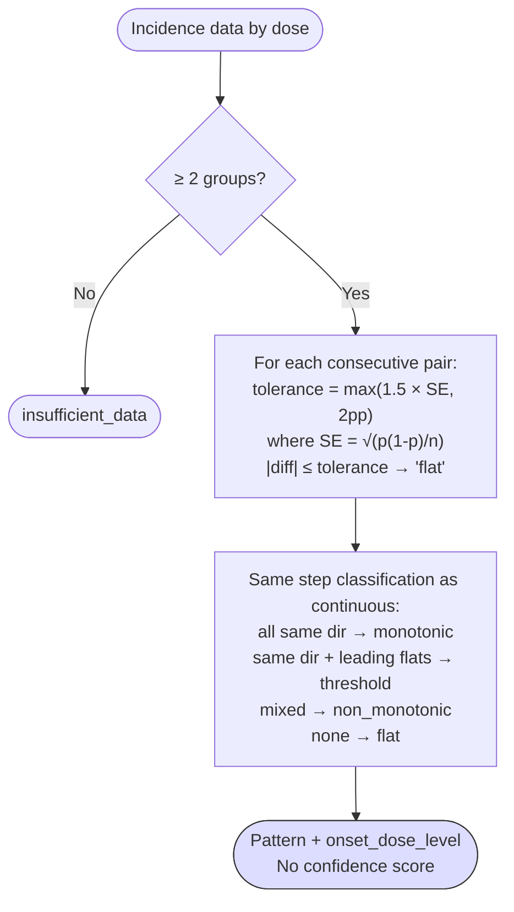

---

## 7. Treatment-Related Determination

`determine_treatment_related()` in `classification.py:408`. Conservative rule-based determination.

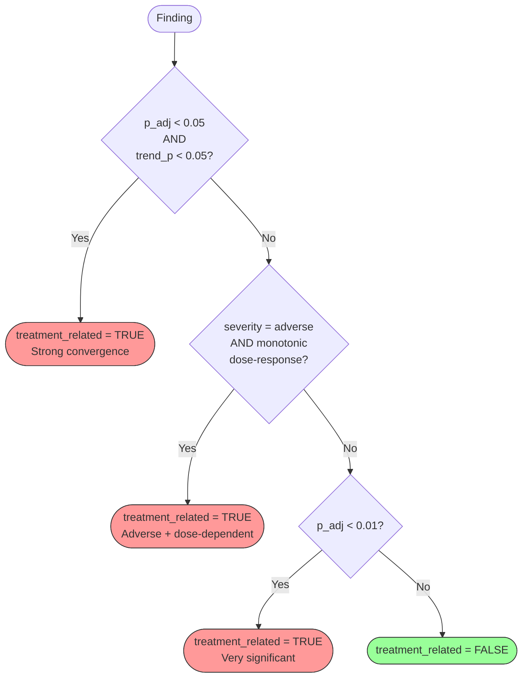

---

## 8. NOAEL Derivation

`build_noael_summary()` in `view_dataframes.py:352`. Determines the No Observed Adverse Effect Level for each sex.

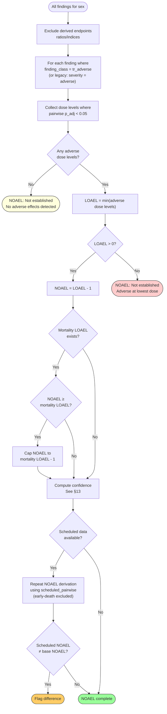

---

## 9. Signal Score Computation

`_compute_signal_score()` in `view_dataframes.py:567`. Combines statistical and biological significance into a 0–1 score.

### 9a. Continuous Data (weights: p=0.35, trend=0.20, effect=0.25, pattern=0.20)

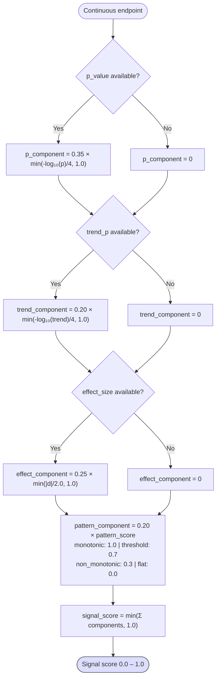

### 9b. Incidence Data (weights: p=0.45, trend=0.30, pattern=0.25, +MI severity 0.10)

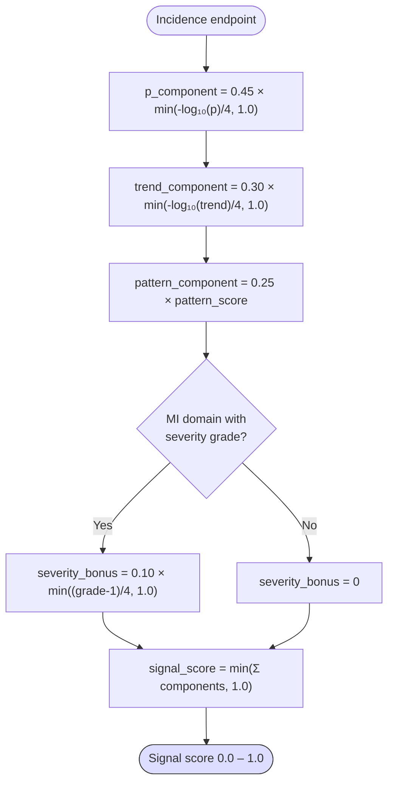

---

## 10. Target Organ Determination

`build_target_organ_summary()` in `view_dataframes.py:109`. Identifies target organs from multi-domain convergent evidence.

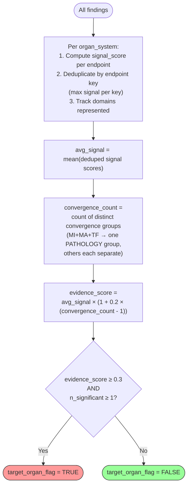

---

## 11. Intrinsic Adversity Lookup

`lookup_intrinsic_adversity()` in `adversity_dictionary.py:41`. Three-tier substring matching for histopathology terms. First match wins (priority order).

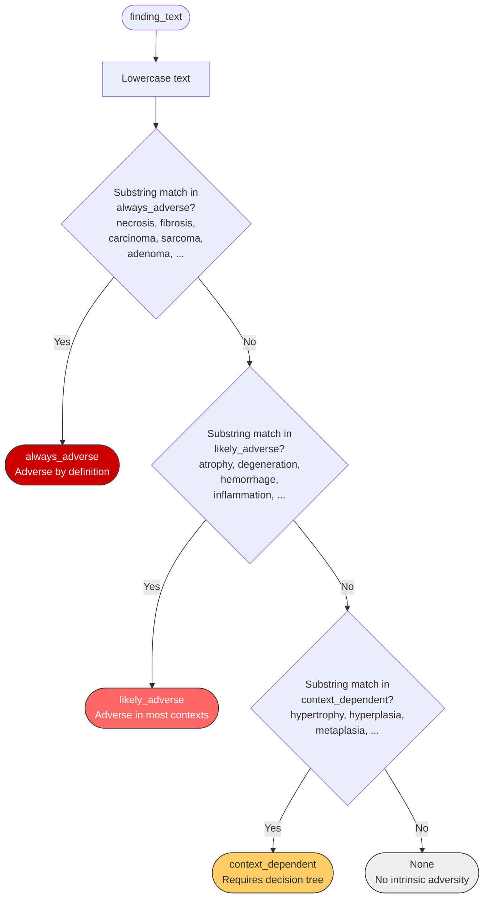

---

## 12. Corroboration Status

`compute_corroboration()` in `corroboration.py`. Determines if a finding has cross-domain support via syndrome definitions.

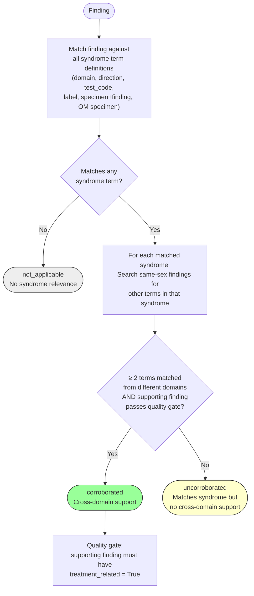

---

## 13. NOAEL Confidence Score

`_compute_noael_confidence()` in `view_dataframes.py:499`. Score starts at 1.0 with penalty deductions.

```mermaid
flowchart TD
    START([Base score: 1.0]) --> P1{n_adverse_at_LOAEL ≤ 1?}
    P1 -->|Yes| D1["−0.20 (single_endpoint)"]
    P1 -->|No| P2

    D1 --> P2{M/F sex AND<br/>opposite sex has<br/>different NOAEL?}
    P2 -->|Yes| D2["−0.20 (sex_inconsistency)"]
    P2 -->|No| P3

    D2 --> P3{Any continuous finding with<br/>|effect_size| ≥ 1.0 AND<br/>p ≥ 0.05?}
    P3 -->|Yes| D3["−0.20 (large_effect_non_significant)"]
    P3 -->|No| P4

    D3 --> P4{ALL adverse findings<br/>at LOAEL are<br/>uncorroborated?}
    P4 -->|Yes| D4["−0.15 (all_uncorroborated)"]
    P4 -->|No| RESULT

    D4 --> RESULT["confidence = max(score, 0.0)<br/>Range: 0.0 – 1.0"]
    RESULT --> OUT([NOAEL confidence])

    style OUT fill:#ddf,stroke:#333
```

---

## 14. A-Factor Scoring

`_score_treatment_relatedness()` in `classification.py:449`. Computes treatment-relatedness score (0–4+ scale).

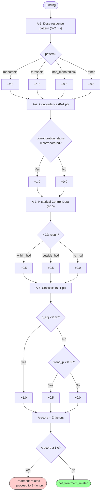

---

## 15. B-6 Progression Chain Evaluation

`evaluate_b6()` in `progression_chains.py`. Checks if a finding is a precursor to documented adverse outcomes via organ-specific progression pathways.

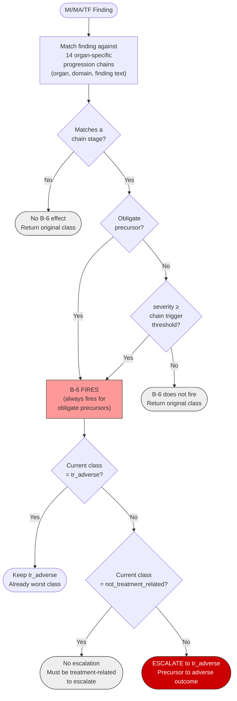

---

## Complete Classification Pipeline

End-to-end flow from raw finding to all output classifications:

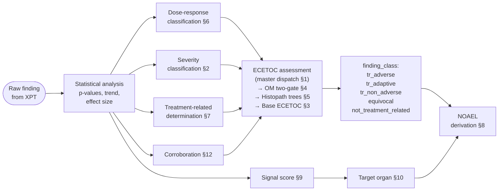
